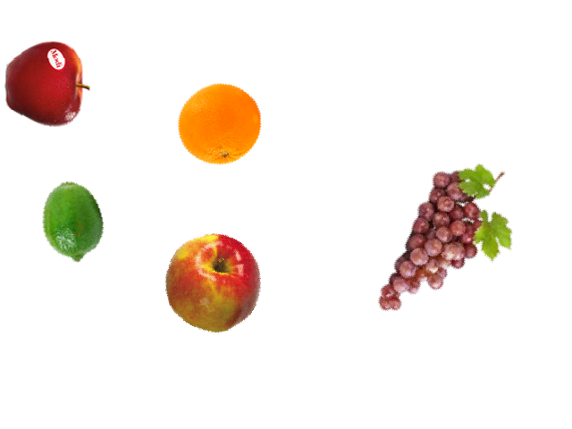

# YOLO-Dataset-Generator
Dataset Generator for custom YOLO dataset, creating new images by overlaying + resize + rotate multiple PNG images.

The code generates images containing objects found in the ```object_classes``` folder. For each object class in the folder, the images should be start from ```1.png``` to ```N.png``` where ```N``` is the number of images in the object's folder. The name of the folder should be the name of the object class.

The images generated also ensure that there are no overlaps between bounding boxes of the objects in the image. You can alter this by not using / changing the code in the method ```check_collision``` in ```utils.py```.

The images can also contain "noise" objects, which are placed in the folder ```others```. The ratio of noise objects to the objects to detect in each image can be altered by the ```noise_weight``` variable in the ```generate_items``` function in ```utils.py```.


## Running the code
To run the code:

```
python generate_images.py
```

## Output Example
Example image:



Example output label txt:

```
0 0.0828125 0.19583333333333333 0.153125 0.20416666666666666
2 0.384375 0.2875 0.1921875 0.25625
0 0.3734375 0.6583333333333333 0.234375 0.3125
```

## Training YOLOv5 on generated dataset

### 1) Download YOLOv5
Download YOLOv5 here:
https://github.com/ultralytics/yolov5

### 2) YAML Config File
Create a new YAML file named ```custom_dataset.yaml``` in the ```data``` folder inside ```yolov5```.

Add this to the YAML file:

```
# Train/val/test sets as 1) dir: path/to/imgs, 2) file: path/to/imgs.txt, or 3) list: [path/to/imgs1, path/to/imgs2, ..]
path: ../datasets/custom_dataset  # dataset root dir
train: images/train  # train images (relative to 'path') 128 images
val: images/val  # val images (relative to 'path') 128 images
test:  # test images (optional)

# Classes
nc: 3  # number of classes
names: ['apple', 'banana','orange']  # class names
```

### 3) Folder Structure
Place the folder ```yolov5``` into your root project folder, and create a folder named ```datasets``` in the same folder.

Create a ```custom_dataset``` folder in ```datasets```, and in that folder, create an ```train``` folder and a ```labels``` folder. Inside each of these train and labels folder create a ```train``` and ```val``` folder.

The final file structure is as show below:

```
project
│
└───yolov5
│   │   train.py
│   │   detect.py
│   └───data
│       │   ...
│       │   coco.yaml
│       │   custom_dataset.yaml
│   
└───datasets
|   |
│   └───custom_dataset
│       └───images
│       │   └───train
│       │   |   |   000.png
│       │   |   |   ...
│       │   └───val
│       │       |   100.png
│       │       |   ...
│       │
│       └───labels
│           └───train
│           |   |   000.txt
│           |   |   ...
│           └───val
│               |   100.txt
│               |   ...
│
```

### 4) Run train script
Follow the official notebook for YOLOv5 here:

https://colab.research.google.com/github/ultralytics/yolov5/blob/master/tutorial.ipynb

Add a cell with the following code to run the ```train.py``` script with our YAML config file for 25 epochs:

```
!python train.py --img 640 --batch 32 --epochs 25 --data custom_dataset.yaml --weights yolov5s.pt --cache
```
